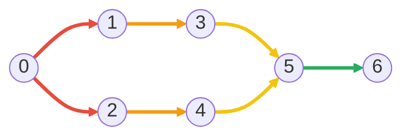
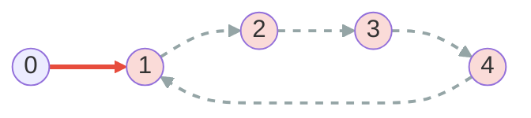
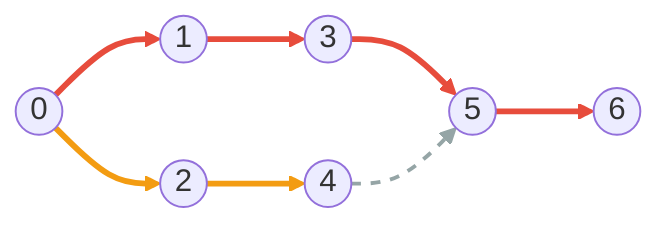
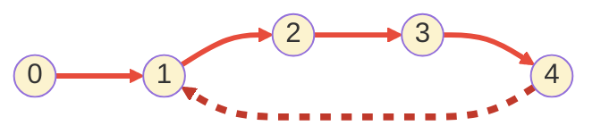

# Topological Sort

A **topological sort** of a directed graph is a linear ordering of its vertices such that for every edge $u \to v$, $u$ appears before $v$. It exists **if and only if** the graph is a directed acyclic graph (DAG) — any cycle makes the ordering impossible, because each vertex on the cycle would have to come before itself.

It shows up anywhere "do A before B" relations need to be flattened into a schedule: build systems linearizing target dependencies, package managers resolving install order, course prerequisites, deadlock-free lock acquisition, and spreadsheet recalculation.

## The Two Standard Algorithms

There are two textbook approaches. Both run in $O(V + E)$ on an adjacency list and both detect cycles for free.

| Algorithm | Direction | What it visits first | Cycle signal              |
| --------- | --------- | -------------------- | ------------------------- |
| Kahn's    | forward   | sources (indegree 0) | leftover vertices         |
| DFS-based | backward  | sinks (no outgoing)  | back edge during recursion |

The worked examples in both sections below run on the **same DAG**, but use coloring rules tailored to each algorithm's structure:

| Algorithm  | Rule                                                                       | Visual effect                  |
| ---------- | -------------------------------------------------------------------------- | ------------------------------ |
| Kahn (BFS) | Edges share a color iff their **source vertex is at the same BFS depth**.  | horizontal **bands** by depth  |
| DFS        | Edges share a color iff they belong to the **same recursive dive**.        | vertical **chains** by dive    |

Same picture, two complementary readings.

### Kahn's Algorithm

The idea: **a vertex can be emitted as soon as nothing else depends on it being emitted later.** That means its indegree (the number of unresolved incoming edges) has dropped to $0$.

1. Compute the indegree of every vertex.
2. Push every vertex with indegree $0$ onto a queue.
3. Repeatedly pop a vertex $u$, append it to the output, and decrement the indegree of each neighbor. If a neighbor's indegree hits $0$, push it.
4. If the output has fewer than $V$ vertices when the queue empties, the graph has a cycle.

#### Worked example

| BFS depth | Color  | Sources at this depth | Edges out of them      |
| --------- | ------ | --------------------- | ---------------------- |
| 0         | red    | `{0}`                 | `0 → 1`, `0 → 2`       |
| 1         | orange | `{1, 2}`              | `1 → 3`, `2 → 4`       |
| 2         | yellow | `{3, 4}`              | `3 → 5`, `4 → 5`       |
| 3         | green  | `{5}`                 | `5 → 6`                |

Kahn pops in pop order `0, 1, 2, 3, 4, 5, 6`. Notice the colors form a **left-to-right rainbow**: every red edge fires before any orange one, every orange before any yellow, and so on. That is the BFS wave-front. Swap the queue for a min-heap to get the **lexicographically smallest** topological order.

#### Cycle detection

The cycle signal in Kahn's is **the queue runs dry before every vertex has been emitted**. Every vertex on a cycle keeps at least one in-edge from another vertex on the same cycle: that predecessor has to be processed first, and they all wait on each other, so none of their indegrees reach $0$.

Consider this graph with a cycle `1 → 2 → 3 → 4 → 1`. Vertex `0` is a clean entry so Kahn has somewhere to start. Initial indegrees: `[0, 2, 1, 1, 1]` — vertex `1` has two predecessors (`0` and `4`), the rest of the cycle each have one.

| Iter | Pop | Queue after | Output | Indegrees     |
| ---- | --- | ----------- | ------ | ------------- |
| 0    | —   | `[0]`       | `[]`   | `[0,2,1,1,1]` |
| 1    | `0` | `[]`        | `[0]`  | `[0,1,1,1,1]` |
| 2    | —   | `[]`        | `[0]`  | stuck         |

After popping `0`, edge `0 → 1` decrements `in_degree[1]` from `2` to `1`. None of `1, 2, 3, 4` ever reaches indegree `0`, so the queue empties with `output.len() == 1 < 5`. The four vertices missing from `output` are exactly the cycle.

Same band coloring as the DAG example: red = edges out of depth-0 sources. Only `0` ever reaches the queue, so only its out-edge `0 → 1` lights up. The dashed-gray edges have sources that are never popped, so no further bands form. The four pink vertices are what Kahn reports as "stuck" — exactly the cycle.

### DFS-based Algorithm

The idea: **a vertex should be emitted only after all its descendants are emitted.** A post-order DFS produces exactly that ordering, in reverse.

1. For each unvisited vertex, run DFS.
2. When a DFS call finishes (all descendants explored), push the vertex onto the output.
3. Reverse the output at the end.

To detect cycles we track **three states** per vertex instead of a boolean visited flag:

| State        | Meaning                                    |
| ------------ | ------------------------------------------ |
| `Unvisited`  | not yet reached                            |
| `InProgress` | on the current DFS path (recursion stack)  |
| `Finished`   | fully processed                            |

If the DFS ever hits a vertex marked `InProgress`, it has found a **back edge** — an edge into an ancestor on the current path, which closes a cycle. A plain visited flag cannot distinguish a back edge (cycle) from a cross edge (harmless), so two states are not enough.

#### Why reversing the post-order works

If $u \to v$ is an edge, the DFS from $u$ explores $v$ before $u$ finishes, so $v$ is pushed to the output first. After reversing, $u$ ends up before $v$. This holds for every edge, which is the definition of a topological order.

#### Worked example

Running DFS from vertex `0` on the same DAG. Edges share a color iff they belong to the same recursive dive — a path from where DFS last branched all the way down to a leaf or to a `Finished` vertex. Dashed stroke = the target was already `Finished`, so DFS short-circuits.

| Dive | Color        | Edges in this dive                          | Triggered by                              |
| ---- | ------------ | ------------------------------------------- | ----------------------------------------- |
| 1    | red          | `0 → 1 → 3 → 5 → 6`                         | first call `visit(0)`, first out-edge     |
| 2    | orange       | `0 → 2 → 4`                                 | back at `0` after dive 1 unwinds          |
| —    | gray, dashed | `4 → 5`                                     | `5` is already `Finished`, return         |

Post-order push sequence: `[6, 5, 3, 1, 4, 2, 0]`. Reversed, the topological order is **`[0, 2, 4, 1, 3, 5, 6]`**.

#### Cycle detection

The cycle signal in DFS is a **back edge** — the recursion lands on a vertex still marked `InProgress`. On the same cyclic graph used in the Kahn section (cycle `1 → 2 → 3 → 4 → 1`, with `0` as a clean entry), DFS dives in along the cycle and detects it as soon as it tries to re-enter `1`.

| Step | Action                          | State changes                                |
| ---- | ------------------------------- | -------------------------------------------- |
| 1    | `visit(0)` recurses on `0 → 1`  | `0,1: InProgress`                            |
| 2    | `visit(1)` recurses on `1 → 2`  | `2: InProgress`                              |
| 3    | `visit(2)` recurses on `2 → 3`  | `3: InProgress`                              |
| 4    | `visit(3)` recurses on `3 → 4`  | `4: InProgress`                              |
| 5    | `visit(4)` tries `4 → 1`        | `state[1] == InProgress` → **cycle!** return `None` |

Same chain coloring as the DAG example: the four red edges `0 → 1 → 2 → 3 → 4` form a **single uninterrupted dive** (the first and only one DFS performs before detection). The thick dashed dark-red edge `4 → 1` is the **back edge** — drawn separately because it does not extend the dive, it lands on a vertex still marked `InProgress`. Every vertex currently colored pale yellow is on the recursion stack at the moment of detection, and that stack **is** a witness to the cycle (`1 → 2 → 3 → 4 → 1`). This is the practical reason to reach for DFS when you need to *identify* the offending cycle, not just know one exists.

## Kahn vs DFS

Both produce a valid topological order on any DAG; they just tend to produce different orders.

### Side-by-side: bands vs chains

Put the two worked-example diagrams next to each other and the BFS-vs-DFS contrast becomes a property of the picture, not just the prose:

- **Kahn (bands)** — colors run **across** the DAG perpendicular to the edges. The red layer fires before any orange edge, every orange before any yellow, etc. That's BFS: the frontier advances one layer at a time.
- **DFS (chains)** — colors run **along** the DAG, following each path. One long red chain races from `0` down to the deepest sink; the shorter orange chain is the next dive after the first unwinds. A dashed edge is the only kind that does not start a fresh dive — its target is already `Finished`. **In a graph with a cycle, that same lookup would find `InProgress` instead, and that is what triggers cycle detection.**

### When to pick which

| Concern                                            | Pick                                  |
| -------------------------------------------------- | ------------------------------------- |
| Want lexicographically smallest order (use a heap) | Kahn's                                |
| Want stable, deterministic output without sorting  | DFS (insertion order of edges)        |
| Deep graphs, worried about stack overflow          | Kahn's (iterative)                    |
| Need to know *which* vertices form the cycle       | DFS (the recursion stack is the cycle) |
| Streaming / online setting where indegree is known | Kahn's                                |

## Complexity

| Algorithm | Time       | Space    |
| --------- | ---------- | -------- |
| Kahn's    | $O(V + E)$ | $O(V)$   |
| DFS       | $O(V + E)$ | $O(V)$   |

Each edge is examined exactly once (when its source is popped, or when DFS traverses it), and each vertex is pushed/popped exactly once.

## API

| Method                       | Description                                                                 |
| ---------------------------- | --------------------------------------------------------------------------- |
| `Graph::new(num_vertices)`   | Build an empty graph with the given number of vertices                      |
| `graph.add_edge(from, to)`   | Add a directed edge `from -> to`                                            |
| `graph.kahn()`               | Topological sort via Kahn's algorithm; `None` if a cycle exists             |
| `graph.dfs()`                | Topological sort via DFS post-order; `None` if a cycle exists               |

## References

- [Topological sorting - Wikipedia](https://en.wikipedia.org/wiki/Topological_sorting)
- Kahn, A. B. (1962). "Topological sorting of large networks". *Communications of the ACM*, 5 (11): 558–562.
